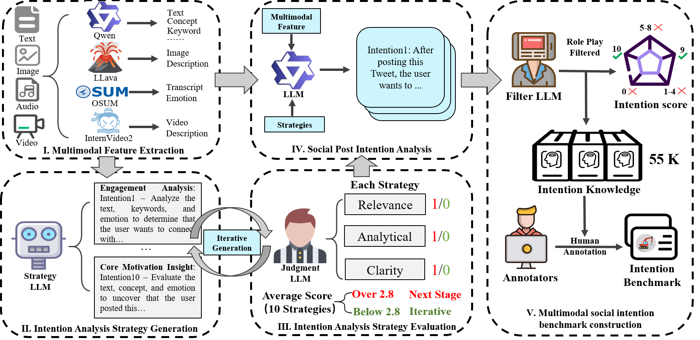

# MINA: Multimodal Intention Analysis of Social Media Posts via LLM-Guided Audio-Visual-Text Reasoning

This repository provides the benchmark data for our paper **MINA: Multimodal Intention Analysis of Social Media Posts via LLM-Guided Audio-Visual-Text Reasoning**, published in **Pattern Recognition, 2026**.

📄 Paper: [MINA: Multimodal Intention Analysis of Social Media Posts via LLM-Guided Audio-Visual-Text Reasoning](https://www.sciencedirect.com/science/article/pii/S0031320326006655)]

## Overview

MINA is designed for **implicit intention understanding** in social media posts.  
Unlike previous approaches that mainly rely on text or image-text pairs, MINA jointly reasons over **text, images, videos, and audio** (https://pan.baidu.com/s/1aW8IloeB1jqWAUj-pS1snA?pwd=7ci5) to better capture the complex and subtle intentions expressed by users in real-world social media scenarios.

To further handle cross-modal inconsistency and varying modality importance, MINA introduces an **LLM-guided intention analysis strategy generation and evaluation mechanism**, which dynamically prioritizes multimodal signals according to their relevance, analytical depth, and clarity for each social media post.

Based on this framework, we build a benchmark on **Twibot-22 tweets** for evaluating the intention reasoning ability of large language models and multimodal large language models. The benchmark contains high-quality multimodal intention knowledge derived from posts with **textual, visual, video, and audio** information, supporting systematic evaluation of open-domain social media intention understanding.

## Framework

The overall framework of MINA is shown below. MINA first extracts multimodal features from text, image, audio, and video inputs. Then, an LLM-guided strategy generation and evaluation module dynamically produces and refines intention analysis strategies. The selected strategy guides the LLM to generate user intentions, which are further filtered to construct high-quality multimodal intention knowledge.




# Tweet Intention Generation Pipeline

This repository generates tweet-intention labels in three stages:

1. Generate 10 analysis strategies for each tweet record.
2. Score the strategies.
3. If the average score is at least `2.8`, generate final intentions. Otherwise, regenerate strategies up to three times. Records that still score below `2.8` are discarded.

## Input format

Prepare a JSONL file, one record per line. Each record should contain a stable ID in `key` or `id`, and the model input in `result`, `information`, or `text`.

```jsonl
{"key": "123", "result": "Text: ...\nImage description: ...\nAudio emotion: ...\nVideo behavior: ..."}
```

## Installation

```bash
pip install -r requirements.txt
```

By default the scripts load `/data/LLM/qwen2_5/Qwen2.5-14B-Instruct`. You can override this with `--model-id` or the `MODEL_ID` environment variable.

## Run the full pipeline

```bash
python pipeline.py --input all_information.jsonl --output-dir outputs --threshold 2.8 --max-attempts 3 --overwrite
```

Important outputs:

- `outputs/strategy_attempts.jsonl`: every generated strategy attempt.
- `outputs/score_attempts.jsonl`: every score attempt.
- `outputs/strategy_final.jsonl`: accepted strategies only.
- `outputs/intention.jsonl`: generated intentions for accepted records.
- `outputs/discarded.jsonl`: records discarded after all attempts.

## Run stages manually

```bash
python round_strategy.py --input all_information.jsonl --output strategy_round-1.jsonl
python round_score.py --information all_information.jsonl --strategies strategy_round-1.jsonl --output score_round-1.jsonl
python intention.py --information all_information.jsonl --strategies strategy_final.jsonl --output intention.jsonl
```

Manual mode is useful for debugging prompts or inspecting intermediate files. For normal use, `pipeline.py` is recommended because it implements the retry-and-discard logic automatically.

## Contribution

- Propose **MINA**, a multimodal intention analysis framework for social media posts.
- Integrate **text, image, video, and audio** signals for unified intention reasoning.
- Design an **LLM-guided intention analysis strategy generation and evaluation mechanism** to dynamically prioritize multimodal information.
- Introduce a **role-play-based intention filtering strategy** to automatically remove unreasonable or irrelevant generated intentions.
- Construct a benchmark based on **Twibot-22 tweets** to evaluate model performance on social media intention understanding.
- Demonstrate that MINA-generated intention knowledge can benefit downstream social media analysis tasks such as bot detection and sarcasm detection.


## Citation

If you find this repository useful, please cite our paper:

```bibtex
@article{lu2026mina,
  title={MINA: Multimodal intention analysis of social media posts via LLM-guided audio-visual-text reasoning},
  author={Lu, Feihong and Yang, Tao and Zhu, Ziqin and Huang, Yudi and Gao, Shiqi and Luo, Yangyifei and Wang, Zengxu and Li, Qian and Sun, Qingyun and Li, Jianxin},
  journal={Pattern Recognition},
  volume={179},
  pages={113700},
  year={2026},
  publisher={Elsevier}
}
